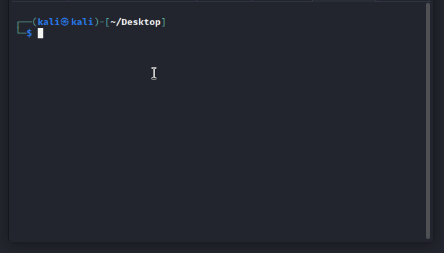

# super-octo-giggle
Exploit Imagick module using arbitrary object instantiation

---

## Instructions

First, set execute permissions on the exploit:

```
chmod u+x exploit.py
```

Modify the IP address of the target, the admin user email, and the password hash:

```
target_url = "http://10.10.11.220"
admin_email = "somebody@boxname.htb" 
admin_hash = "$2y$10$TheWholeBcryptHashGoesHere"
```

Run it:

```
./exploit.py
```





## Acknowlegement
Inspiration for this came from this article: https://swarm.ptsecurity.com/exploiting-arbitrary-object-instantiations/
Built upon the original python code provided by HTB user @0xButch (modified into a GET-based webshell) ~ Thank you so much!
---

Enjoy your webshell

 :handshake::handshake::handshake::handshake:
@4wayhandshake

